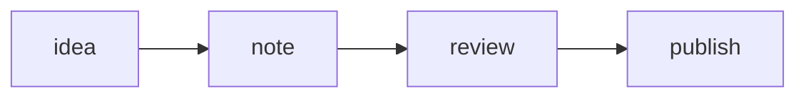
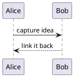

# Adding Notes

Create any `.md` file under `content/notes/`. Subdirectories are supported.

## Frontmatter

Notes support the following optional frontmatter fields:

```yaml
---
title: My Note Title
tags: [tag1, tag2]
date: 2026-01-01
draft: true
---
```

- `draft: true` — note is excluded from the published site
- `title` — used as the page heading; defaults to the file name if omitted

## Obsidian features

The following Obsidian syntax is rendered correctly:

- `[[wikilinks]]` and `[[wikilinks|aliases]]`
- Callouts: `> [!NOTE]`, `> [!WARNING]`, `> [!TIP]`, etc.
- Standard tags: `#tag`

Dataview queries are **not** rendered — avoid them or use plain markdown equivalents.

## Diagrams

Fenced code blocks tagged `mermaid` or `plantuml` are turned into SVG in the
browser and follow the light/dark theme toggle. Nothing is rendered at build
time, so the diagram engines are only downloaded on pages that actually use them.

A **Mermaid** flowchart:

````md

````


A **PlantUML** sequence diagram — write the full `@startuml`/`@enduml` source:

````md

````


PlantUML covers diagram types Mermaid does not, such as mindmaps, component and
deployment diagrams, and Graphviz-laid-out graphs. A diagram that fails to parse
renders a small "Diagram could not be rendered" notice in place of the source.
