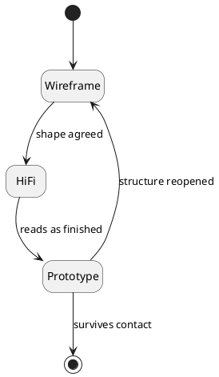

# The Fidelity Ladder

Match the fidelity of the artifact to the conversation you want to have.
Mismatching them costs the conversation, every time.

<figure>
  <svg viewBox="0 0 640 180" role="img" aria-labelledby="ladder-title"
       width="100%" style="max-width:640px;height:auto;color:currentColor">
    <title id="ladder-title">Wireframe to hi-fi to prototype, mapped to audience</title>
    <line x1="40" y1="120" x2="600" y2="120" stroke="currentColor"
          stroke-width="1.5" opacity="0.4" />
    <!-- rung 1 -->
    <circle cx="120" cy="120" r="9" fill="currentColor" />
    <text x="120" y="92" text-anchor="middle" font-family="serif"
          font-size="18" fill="currentColor">wireframe</text>
    <text x="120" y="150" text-anchor="middle" font-family="monospace"
          font-size="12" fill="currentColor" opacity="0.6">collaborators</text>
    <!-- rung 2 -->
    <circle cx="320" cy="120" r="9" fill="currentColor" />
    <text x="320" y="92" text-anchor="middle" font-family="serif"
          font-size="18" fill="currentColor">hi-fi</text>
    <text x="320" y="150" text-anchor="middle" font-family="monospace"
          font-size="12" fill="currentColor" opacity="0.6">stakeholders</text>
    <!-- rung 3 -->
    <circle cx="520" cy="120" r="9" fill="currentColor" />
    <text x="520" y="92" text-anchor="middle" font-family="serif"
          font-size="18" fill="currentColor">prototype</text>
    <text x="520" y="150" text-anchor="middle" font-family="monospace"
          font-size="12" fill="currentColor" opacity="0.6">users</text>
    <text x="40" y="40" font-family="monospace" font-size="12"
          fill="currentColor" opacity="0.6">low fidelity</text>
    <text x="600" y="40" text-anchor="end" font-family="monospace" font-size="12"
          fill="currentColor" opacity="0.6">high fidelity</text>
  </svg>
  <figcaption>Each rung invites a different kind of feedback.</figcaption>
</figure>

## The rule

| Artifact | Audience | The question it asks |
|---|---|---|
| Wireframe | Collaborators | *Is the shape right?* |
| Hi-fi mockup | Stakeholders | *Does this read as finished?* |
| Prototype | Users | *Does it survive contact?* |

Show a user a wireframe and they critique the box-drawing. Show a collaborator a
hi-fi mockup and they stop touching the structure because it looks decided. The
fidelity is a signal about how settled the thing is — so lying about fidelity
lies about how much is still open.

> [!warning] Don't dress up an open question
> A polished mockup of an undecided flow reads as *decided*. People stop
> poking at the structure because it looks finished — and you have just spent
> your feedback budget on the wrong layer.

> [!info] Rule of thumb
> If you are not sure which rung you are on, you are probably one rung too high.

## Climbing it

You climb a rung only once the question on the current one is answered — and you
are allowed to fall back down when a later conversation reopens the structure:

This is the same discipline as a [[shipping-cadence]]: the form of the artifact
tells people what kind of response it wants.
