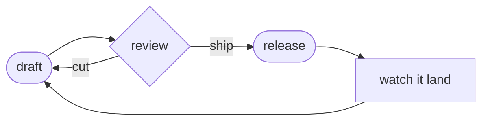

# Shipping Cadence

The cadence is the product. A team that ships every week is a different organism
from one that ships every quarter, even building the same thing.

## The loop

A cadence is just a loop you refuse to break. Drawn out, the one I keep coming
back to:

The arrow that matters is `review --|cut|--> draft`. Most teams only have the
ship arrow, so review becomes a rubber stamp and the loop loses its teeth.

> [!tip] Protect the cut arrow
> A review that can only approve is not a review. If nothing has been cut in a
> month, the loop has quietly straightened out into a conveyor belt.

## Why weekly

- A week is short enough that nobody can hide a stuck thing for long.
- It is long enough to contain a real edit pass — see [[soft-deadlines]] for
  what happens when the edit pass keeps slipping.
- It maps to how people actually plan their attention. Months are fiction.

> [!example]- One concrete week
> Mon: draft lands. Tue–Wed: it sits, someone reads it cold. Thu: review, two
> things cut. Fri: ship, then watch it land over the weekend. Repeat. The dates
> are boring on purpose — that is the whole trick.

The bar for "done enough" is not *finished* — it is *the system is doing the
lifting, not the discipline*. Once you are relying on willpower to hit the
cadence, the cadence is already broken.
