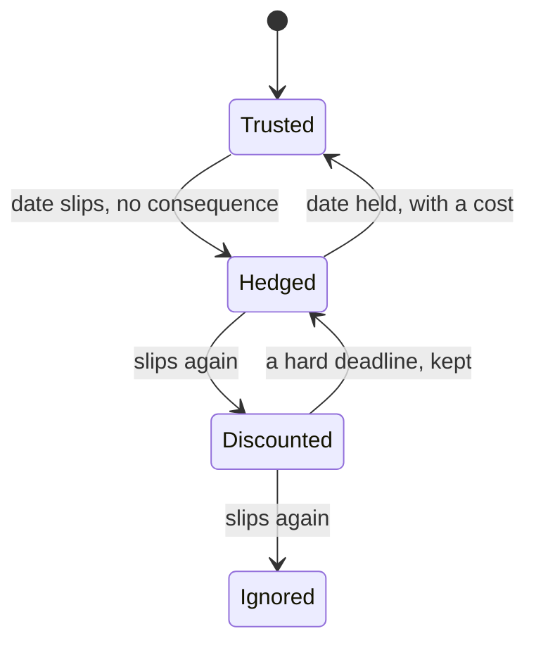

# Soft Deadlines

A deadline that slips without consequence trains everyone to discount the next
one. This is the whole essay, but it is worth drawing out *why* the discount
compounds.

## The trust state machine

Every deadline is a small bet on whether the next date means anything. Each
quiet slip moves the team one state down:

Climbing back *up* is expensive — it takes a deadline that was visibly costly to
hold. That asymmetry is the point: you lose trust for free and buy it back at a
premium.

> [!danger] The point of no return
> Once a team reaches *Ignored*, dates stop carrying information at all —
> planning quietly migrates to back-channels and gut feel. Reversing that is a
> culture project, not a calendar fix.

## What actually helps

- Fewer dates, each load-bearing. A calendar full of soft dates is noise.
- When a date *must* move, name the cost out loud. A slip that is paid for is
  not the same as a slip that is shrugged off.
- Tie dates to a [[shipping-cadence]], not to heroics. A cadence makes the next
  date legible before anyone has to defend it.

> [!NOTE]
> The failure mode is not missing a date. It is missing it *quietly*.
