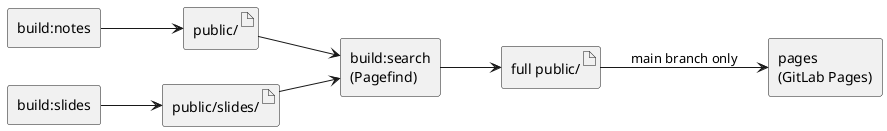

# Vault Static Site Architecture

Design decisions for the Teaman vault's static site pipeline.

## Repository Structure

Monorepo with clean separation between content and build tooling:

```
/
├── content/          # Obsidian vault root (future: git submodule)
│   ├── notes/        # Standard Obsidian markdown
│   ├── slides/       # Slidev decks (*.md); prefix _ to mark draft
│   └── guides/       # Multi-chapter books (dirs containing SUMMARY.md)
├── site/             # Astro project + single Slidev installation
└── .gitlab-ci.yml
```

Content types are separated by **folder** — unambiguous for build pipelines and
requires no frontmatter discipline. Frontmatter schemas differ per type and are
intentionally not cross-compatible.

## Static Site Generator: Astro

Astro is the primary SSG wrapper. Each content type integrates differently.

### Notes

- Astro content collections via the glob loader (`../content/notes/**/*.md`)
- Obsidian syntax handled by remark/rehype plugins:
  - `remark-wiki-link` — `[[wikilinks]]` → HTML anchors
  - `rehype-callouts` — `> [!NOTE]` callout blocks
- **Future upgrade path**: Quartz preprocessor can be dropped in as a step
  before Astro's content layer. Abstraction boundary is maintained so this is
  a one-step swap, not a rewrite.

### Slides

- A single `@slidev/cli` installation lives in `site/`; all decks are `.md` files
- `build-slides.mjs` globs `content/slides/*.md` (skipping `_`-prefixed drafts),
  builds each with `slidev build`, outputs to `public/slides/<deck-name>/`
- Astro owns a gallery/index page linking to the built SPAs
- Slidev theme uses the same CSS custom property names as the Astro theme
  (manually kept in sync — see Theming section)

### Guides

- Each directory under `content/guides/` containing a `SUMMARY.md` is a guide
- `SUMMARY.md` provides the guide title (`# H1`) and chapter ordering
  (markdown bullet list of links to chapter files)
- Astro content collection (`guides`) loads chapter `.md` files; a single
  `pages/guides/[...slug].astro` route renders both the guide root (first
  chapter) and per-chapter pages with shared sidebar TOC + prev/next nav
- All chrome — typography, callouts, code blocks — comes from the same
  remark/rehype pipeline as notes, so theming stays consistent

## CI Pipeline

Two parallel build jobs merge their artifacts into a single Pagefind pass,
then deploy:

```
build:notes  ─┐
build:slides ─┴─► build:search ─► pages (main branch only)
```

- `build:notes` → runs `astro build` (notes + guides), artifact: `public/`
- `build:slides` → runs `slidev build` per deck, artifact: `public/slides/`
- `build:search` → GitLab merges artifacts, runs Pagefind, artifact: full `public/`
- `pages` → GitLab Pages deploy (only on default branch)

Drawn as a component graph, the data and artifacts flow like this:



**Future**: add `changes:` rules per job for incremental builds. A theme change
should trigger both jobs.

## Search

Pagefind crawls the fully assembled `public/` as a post-build step, producing a
unified search index across notes, slides, and guides. Slidev decks are added
as custom records (their SPA bodies are empty pre-JS) — every other content
type is crawled directly from its built HTML.

## Theming

`site/src/styles/tokens.css` defines CSS custom properties (colors, typography,
spacing). The Slidev theme references the same property names — kept in sync
manually.

**Future**: extract tokens to a shared JSON/JS config and generate CSS variables
via a build step.

## URL Configuration

`SITE_BASE` env var (default: `/$CI_PROJECT_NAME/`) is set in one place (CI) and
consumed by:

- `astro.config.mjs` → `base` option (notes + guides)
- `build-slides.mjs` → `--base` flag per deck

## Conventions

| Convention | Meaning |
|---|---|
| `_*.md` in `slides/` | Draft deck — excluded from build |
| `SUMMARY.md` in a `guides/` subdir | Marks directory as a guide; defines title + chapter order |
| `draft: true` in note frontmatter | Excludes note from published site |
| `SITE_BASE` env var | Single config point for URL base path |
