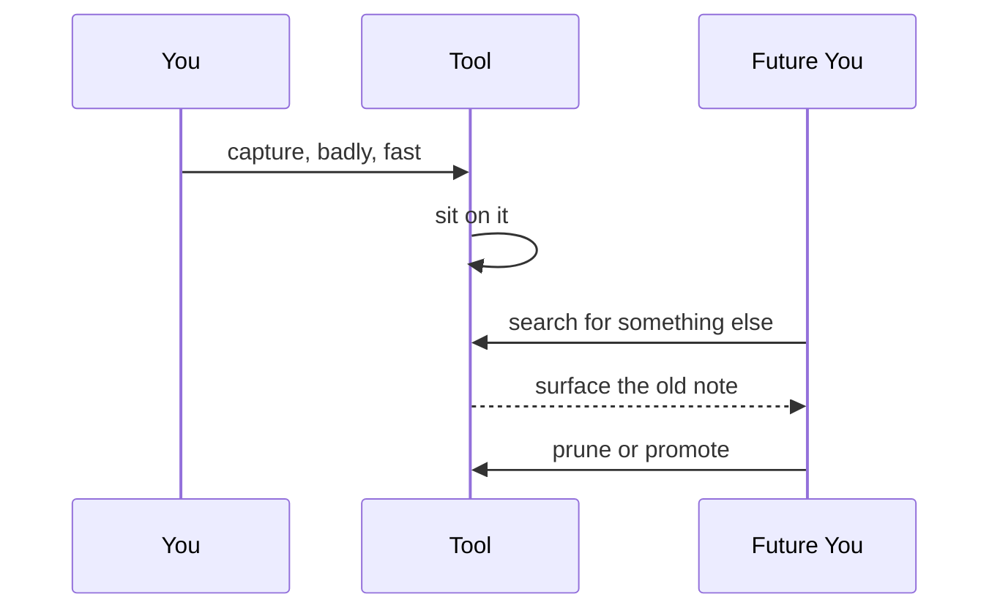
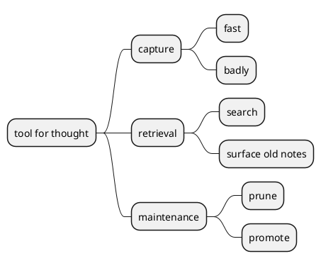

# Tools for Thought, Minus the Manifesto

Most "tools for thought" decks are manifestos in disguise. They sell a worldview
and ship a backlog. The honest version is much smaller and much more boring.

  <svg viewBox="0 0 48 48" width="40" height="40" fill="none"
       stroke="currentColor" stroke-width="2.5" stroke-linecap="round"
       stroke-linejoin="round" style="color:currentColor;vertical-align:middle">
    <path d="M24 12c-4-4-10-4-14-2v26c4-2 10-2 14 2" />
    <path d="M24 12c4-4 10-4 14-2v26c-4-2-10-2-14 2" />
    <line x1="24" y1="12" x2="24" y2="38" opacity="0.5" />
  </svg>

> [!quote]
> A tool for thought earns the name when it survives a boring Tuesday — not when
> it photographs well in a launch thread.

## What the loop actually is

Capture is cheap; the value is in what the tool makes you do *next*:

The manifesto sells the first arrow. The work is all in the last one — pruning
and promoting — which is unglamorous and never demoed.

The whole surface fits on one small map — and the manifestos almost always
overbuild the left branch while starving the right:

## The test

> [!question]+ Does this note pass the one-sentence test?
> If you cannot summarise it in a single sentence a week later, it was
> entertainment. That is allowed — just file it as such, and stop guilt-tripping
> yourself about the backlog.

A note that stuck is one I can summarise in a single sentence a week later. The
rest was entertainment, which is fine, as long as I stop pretending otherwise.
The discipline here rhymes with a [[shipping-cadence]]: a steady, unromantic
loop beats a brilliant burst.

