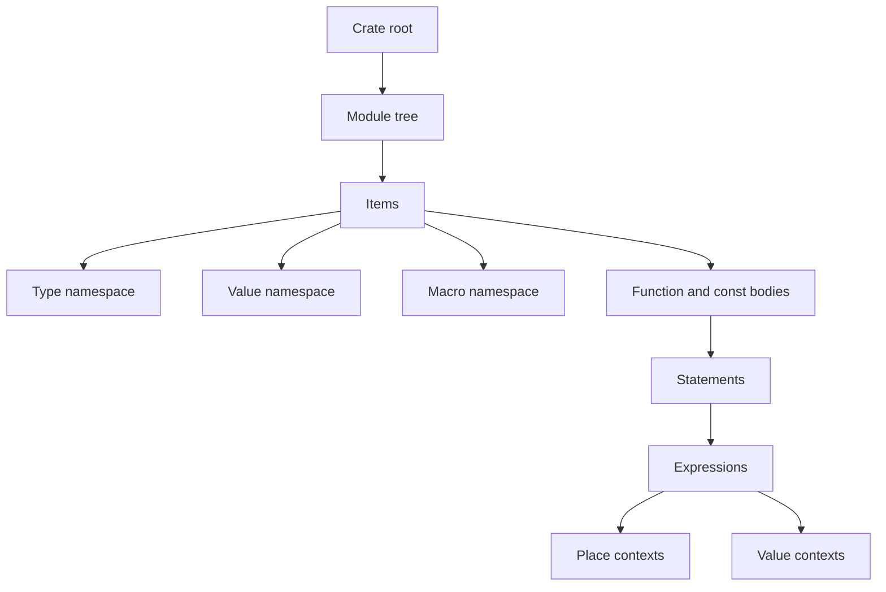
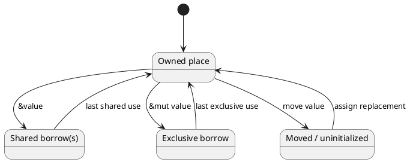

# Rust systems programming field reference

This document is a compact field reference for reading and reviewing Rust
systems code. It connects the rules that tend to matter together in practice:
names and visibility, places and values, ownership and borrowing, patterns and
drop scopes, generic contracts, representation, and unsafe boundaries.

> [!important] Non-authoritative companion
> This is an independently written example document, not the Rust language
> specification. When exact wording, edition differences, or edge cases matter,
> consult [The Rust Reference](https://doc.rust-lang.org/reference/) for the
> toolchain version you use. The Reference covers stable language behavior; the
> standard library, Cargo, and compiler command-line behavior have separate
> documentation.

## How to use this document

Use the table of contents when you know the subsystem and document search when
you know a term such as **place expression**, **drop scope**, **binding mode**,
or **proof obligation**. Sections are written to stand alone, so a search result
should provide enough context without requiring a front-to-back reading.

This field guide distinguishes three kinds of statement:

| Label | Meaning | Review posture |
| --- | --- | --- |
| Rule | A language-level constraint or behavior | Verify against the official Reference when correctness depends on it |
| Model | A useful way to reason about several rules together | Use it to predict behavior, then confirm unusual cases |
| Practice | An engineering convention rather than a language requirement | Adapt it to the codebase and risk level |

> [!tip]
> Start a difficult review by classifying each expression as a place or a
> value, each binding as owning or borrowing, and each unsafe operation by the
> invariant it assumes. Most subtle questions become smaller after those three
> passes.

## Language boundary and editions

Rust's language specification is intentionally separate from its ecosystem.
The language defines syntax and semantics. The standard library supplies types
such as `Vec<T>`, `Box<T>`, `Arc<T>`, and synchronization primitives, although a
small number of library types and traits receive special compiler treatment.
Cargo defines packages, dependency resolution, features, and build scripts.
`rustc` defines compiler flags and implementation details not promised by the
language.

### Stable language versus implementation behavior

A conforming program should depend on specified observable behavior, not on a
particular optimization or current compiler artifact. Layout, symbol names,
temporary lifetimes, and evaluation details are especially dangerous places to
infer a contract from one experiment.

> [!warning] A successful experiment is evidence, not a specification
> If code relies on a memory layout, drop point, coercion, or aliasing rule,
> locate the language or library contract that guarantees it. Compiler output
> may change while remaining correct.

### Editions

Editions allow Rust to introduce coordinated, opt-in language changes while
preserving compatibility between crates. Crates from different editions can be
linked. Edition differences affect parsing and name resolution in selected
areas; they do not create separate Rust runtimes.

When reading code, establish:

1. the crate edition;
2. the minimum supported Rust version;
3. enabled target and feature configuration;
4. whether any nightly feature gates are present.

## Source text, tokens, and syntax

Rust source is UTF-8 and is processed as tokens before syntactic forms are
recognized. Whitespace and comments usually separate tokens without otherwise
changing meaning. Macro systems make token boundaries operationally important:
a macro can accept and produce token trees that are parsed in a later context.

### Identifiers and keywords

Identifiers name entities such as variables, items, lifetimes, fields, and
labels. Keywords fall into strict, reserved, and context-sensitive groups. A
raw identifier such as `r#type` permits some keyword spellings to be used as an
identifier where compatibility requires it.

```rust
fn classify(r#type: &str) -> &'static str {
    match r#type {
        "request" => "input",
        "response" => "output",
        _ => "other",
    }
}
```

Lifetimes and loop labels use a leading apostrophe, but they occupy different
semantic roles:

```rust
fn first<'a>(values: &'a [u8]) -> Option<&'a u8> {
    'search: loop {
        break 'search values.first();
    }
}
```

### Comments and documentation

Line comments begin with `//`; block comments use `/* ... */` and may nest.
Documentation comments are translated to `doc` attributes. Outer documentation
describes the following item, while inner documentation describes the item that
contains it, commonly a crate or module.

```rust
//! Parser primitives shared by protocol implementations.

/// A validated frame length in bytes.
pub struct FrameLen(u32);
```

### Grammar notation as a reading tool

The official Reference presents grammar productions before prose rules. Read a
production as the set of shapes the parser accepts, not as the complete semantic
contract. Type checking, name resolution, visibility, and safety rules are
applied after a syntactically valid form is recognized.

## Crates, modules, and items

A crate is a compilation and name-resolution unit whose root is a module. That
root contains items and nested modules, forming a logical module tree. A module
may be inline or loaded from another source file; the logical tree matters more
than the physical layout once loading is resolved.



### Item inventory

Items introduce program entities at module, trait, implementation, external,
or block scope. The major forms are:

| Item | Primary role | Typical members |
| --- | --- | --- |
| `mod` | Namespace and visibility boundary | Other items |
| `fn` | Callable item | Parameters, return type, body |
| `struct`, `enum`, `union` | Nominal data type | Fields or variants |
| `trait` | Behavioral contract | Associated types, constants, functions |
| `impl` | Inherent or trait implementation | Associated items |
| `type` | Type alias | An aliased type expression |
| `const`, `static` | Named value or storage | Type and initializer |
| `use` | Bring paths into scope | Imports and re-exports |
| `extern` block | Foreign declarations | Functions and statics |
| macro item | Syntax transformation | Matcher or procedural entry point |

Item names are generally in scope throughout their containing module or block,
which is why a function can call another item declared later in the file.

### Module files and logical paths

An outlined module such as `mod codec;` asks the compiler to load that module's
body from a corresponding file. Common layouts include:

```text
src/lib.rs            crate root
src/codec.rs          crate::codec
src/codec/frame.rs    crate::codec::frame
```

The older `codec/mod.rs` form remains meaningful, but a module must not be
provided simultaneously by both accepted locations. The `path` attribute can
override file discovery; use it sparingly because it separates the logical tree
from the directory structure readers expect.

### Visibility and reachability

Items are private by default. `pub` exposes an item from its module, while
restricted forms such as `pub(crate)` and `pub(super)` limit where the name may
be used. Public API review must follow the entire path: a public item hidden
behind a private ancestor is not externally nameable through that path.

```rust
mod transport {
    pub(crate) struct Frame {
        pub payload: Vec<u8>,
        pub(crate) checksum: u32,
    }
}
```

> [!note]
> Visibility controls name access, not memory access or secrecy. Debug output,
> serialization, side channels, and unsafe code are separate concerns.

### Imports and re-exports

`use` creates local aliases for paths. A public import can also make a path part
of the module's external API.

```rust
mod wire {
    pub struct Header;
}

pub use wire::Header;
```

Glob imports are concise but make the set of candidates less obvious. In core
infrastructure, explicit imports usually make review and future conflict
resolution easier.

## Names, namespaces, paths, and scopes

Name resolution connects a path or identifier to a declared entity. Rust keeps
several namespaces, allowing the same spelling to denote different kinds of
entity when context distinguishes them.

### Namespace model

The most visible namespaces are:

| Namespace | Examples |
| --- | --- |
| Type | modules, structs, enums, traits, type aliases, generic types |
| Value | functions, constants, statics, local bindings, tuple constructors |
| Macro | bang macros, attributes, derives |
| Lifetime | lifetime parameters |
| Label | loop and block labels |

Fields do not behave like ordinary module names; field lookup is constrained by
the type of the expression being accessed. Associated items are reached through
their type or trait, or by method-call lookup where applicable.

### Absolute and relative paths

`crate`, `self`, and `super` anchor paths relative to the current crate and
module. A leading external crate name may resolve through the extern prelude.
Inside generic code, a qualified path can identify which trait's associated
item is intended.

```rust
fn render<T>(value: &T) -> String
where
    T: core::fmt::Display,
{
    <T as core::fmt::Display>::fmt;
    format!("{value}")
}
```

The unused path expression above is intentionally illustrative: qualified
syntax names the `Display` implementation's associated function without relying
on method lookup.

### Scope and shadowing

A scope is the region where a name can be used. Local bindings typically become
available after their declaration. Items declared directly in a module are in
scope across that module. Nested modules do not automatically inherit item names
from an outer module; use a path or import.

Shadowing creates a new binding rather than mutating the old one:

```rust
let packet = receive();
let packet = validate(packet)?;
let packet = decode(packet)?;
```

This style is effective when each step changes the value's type or invariants.
It is confusing when the bindings represent different domain concepts, so name
those separately.

## Types and type expressions

Every value, variable, and item has a type. A type determines how bits are
interpreted and which operations are permitted. Type expressions are syntax
that refer to types; type aliases create alternate names but not new nominal
types.

### Type families

| Family | Representative forms | Key property |
| --- | --- | --- |
| Scalar | `bool`, integers, floats, `char` | Single logical value |
| Text | `str`, `String` | UTF-8 data; `str` is dynamically sized |
| Sequence | tuples, arrays, slices | Ordered component values |
| Nominal | structs, enums, unions | Identity comes from declaration |
| Callable | function items, pointers, closures | Can be invoked |
| Pointer | references, raw pointers | Indirection with different guarantees |
| Trait-facing | `impl Trait`, `dyn Trait` | Static abstraction or dynamic dispatch |
| Never | `!` | No possible value; represents divergence |

### Nominal and structural types

Two structs with identical fields are still distinct types because each struct
declaration introduces a nominal identity. Tuples and arrays are structural:
their component types and, for arrays, length determine the type.

```rust
struct UserId(u64);
struct OrderId(u64);

fn load_user(id: UserId) { /* ... */ }

let order = OrderId(7);
// load_user(order); // different nominal type
```

Newtypes like these express units, validation state, and authority without
changing the runtime representation unless another rule does so.

### Sized and dynamically sized types

Most generic type parameters have an implicit `Sized` bound. Dynamically sized
types such as `str`, slices, and trait objects do not have a compile-time-known
size. They are normally used behind a pointer whose metadata completes the
description of the referent.

```rust
fn encoded_len<T: ?Sized>(value: &T) -> usize {
    core::mem::size_of_val(value)
}
```

`?Sized` relaxes the implicit bound; it does not mean that every operation can
work without a known size.

### Recursive types

A nominal type may refer to itself, but recursion must pass through indirection
so the type has finite size.

```rust
enum Node<T> {
    Empty,
    Branch {
        value: T,
        next: Box<Node<T>>,
    },
}
```

### Inference, coercion, and casts

Inference fills in types constrained by surrounding code. Coercions are
implicit conversions permitted at specific sites, such as reborrowing a mutable
reference as shared or converting an array reference to a slice reference.
Casts use `as` and cover a defined set of explicit conversions.

> [!warning]
> A cast is not a general-purpose conversion protocol. Prefer named checked
> conversions when truncation, sign changes, invalid discriminants, or pointer
> provenance could matter.

## Expressions, statements, and blocks

Rust is expression-oriented. Many constructs that are statements in other
languages produce values here, including blocks, `if`, `match`, and loops with
value-bearing `break` expressions.

```rust
let class = if bytes.is_empty() {
    "empty"
} else if bytes.len() < 64 {
    "small"
} else {
    "large"
};
```

### Block result and semicolons

The final expression of a block becomes the block's value when it is not
terminated by a semicolon. Adding a semicolon commonly changes the result to
unit `()`.

```rust
fn doubled(value: u32) -> u32 {
    value * 2
}
```

Semicolon rules also distinguish expression statements from value-producing
tail expressions. During review, a seemingly harmless semicolon can be a type
change.

### Place expressions and value expressions

A **place expression** denotes a memory location. Local variables, statics,
dereferences, array indexing, and field access can produce places. A **value
expression** denotes a value, often a temporary.

The surrounding context determines what happens to a place:

- assignment writes it;
- borrowing creates a reference to it;
- a move context transfers its value when the type is not `Copy`;
- other value contexts may copy or move from it;
- compound assignment reads and then writes it under its specific rules.

```rust
let mut record = String::from("ready");
let view = &record;          // borrow the place
println!("{view}");
record = String::from("go"); // write after the borrow's last use
```

This vocabulary is more precise than saying that every expression simply
"returns a value."

### Control-flow expressions

`return`, `break`, `continue`, and panic-like divergence alter normal flow.
The never type `!` describes expressions that do not produce a value for their
continuation. This lets a diverging branch coexist with a value-producing one.

```rust
let port = match configured_port() {
    Some(port) => port,
    None => return Err("missing port"),
};
```

### Evaluation and temporary lifetime

Temporary values receive drop scopes based on their syntactic context. Some
`let` initializers extend temporary lifetimes, but this is a specific language
rule rather than a general promise that a useful temporary lives to the end of
the block.

> [!important]
> When a reference points into a temporary, inspect the exact expression form.
> Refactoring an initializer into a call or block can change the temporary's
> drop scope even when the types look similar.

## Ownership, moves, and copying

Ownership is the responsibility for eventually dropping a value. A move
transfers that responsibility from one place to another. After a complete move,
the source cannot be read as an initialized value until it is assigned again.

```rust
let request = String::from("GET /");
let queued = request;
// println!("{request}"); // use after move
send(queued);
```

### `Copy` values

For a type implementing `Copy`, value contexts copy bits instead of making the
source unavailable. `Copy` is appropriate only when such duplication has the
same semantics as ordinary value copying and the type has no destructor.

```rust
#[derive(Clone, Copy)]
struct Offset {
    x: i32,
    y: i32,
}
```

`Clone` is an explicit operation and may perform arbitrary work. `Copy` is an
implicit language behavior with stronger restrictions.

### Partial moves

Moving a field can leave the remainder of a value partially initialized. Fields
that remain initialized may still be usable, but the whole value generally is
not. Types implementing `Drop` impose additional restrictions because their
destructor expects the complete value.

```rust
struct Envelope {
    header: String,
    payload: Vec<u8>,
}

let envelope = read_envelope();
let payload = envelope.payload;
println!("{}", envelope.header);
consume(payload);
```

### Assignment and replacement

Assignment drops the previous initialized value of the destination before
replacing it. Utilities such as `mem::replace`, `Option::take`, and collection
APIs make replacement states explicit and are often clearer than elaborate
manual movement.

## Borrowing, references, and lifetimes

A reference is a borrow of an existing value. Shared references `&T` permit
shared access under their contract; mutable references `&mut T` provide unique
access for the relevant lifetime. Lifetimes describe regions in which borrows
must remain valid.



The diagram is a review model, not a complete borrow-checker state machine.
Actual acceptance depends on control flow, lifetime constraints, projection,
and the compiler's analysis.

### Shared and mutable access

The useful shorthand "many readers or one writer" captures part of the model,
but references also promise alignment, validity, and other requirements. A
shared reference is not permission to mutate through ordinary means. Interior
mutability places controlled mutation behind types built around `UnsafeCell`.

```rust
fn increment(value: &mut u64) {
    *value += 1;
}
```

The original owner remains responsible for the value, but cannot use it in a
way that conflicts with the active borrow.

### Reborrowing

Using a mutable reference can create a shorter reborrow instead of moving the
reference itself. Reborrowing is what allows repeated calls through the same
`&mut T` when their borrow regions do not overlap.

```rust
fn clear_twice(buffer: &mut Vec<u8>) {
    buffer.clear();
    buffer.extend_from_slice(b"ready");
    buffer.clear();
}
```

### Lifetime parameters

Lifetime annotations relate input and output borrows; they do not extend the
runtime life of data. Elision rules infer common relationships in function and
method signatures.

```rust
fn choose<'a>(left: &'a str, right: &'a str, use_left: bool) -> &'a str {
    if use_left { left } else { right }
}
```

The returned reference is constrained so it cannot outlive the relevant input
borrow. The caller chooses concrete regions that satisfy the relationship.

### Raw pointers

Raw pointers `*const T` and `*mut T` carry fewer compiler-enforced guarantees
than references. Creating many raw pointers can be safe; dereferencing one is
an unsafe operation whose caller must establish validity, alignment, aliasing,
and lifetime requirements.

> [!danger]
> Do not create a reference merely to make a raw pointer easier to use unless
> the full reference validity contract already holds. A transient invalid
> reference is still invalid even if it is immediately converted again.

## Patterns and binding modes

Patterns test structure and optionally bind names. They appear in `let`
bindings, parameters, `match`, `if let`, `while let`, `for`, and other forms.

```rust
enum Event {
    Connected { peer: String },
    Data(Vec<u8>),
    Closed,
}

match event {
    Event::Connected { peer } => register(peer),
    Event::Data(bytes) if !bytes.is_empty() => ingest(bytes),
    Event::Data(_) => {}
    Event::Closed => shutdown(),
}
```

### Refutable and irrefutable patterns

An irrefutable pattern matches every value of its expected type and is required
where failure cannot be handled, such as ordinary function parameters and
simple `let` bindings. Refutable patterns are accepted in branching constructs
that define what happens when matching fails.

| Context | Pattern requirement |
| --- | --- |
| Function parameter | Irrefutable |
| `let pattern = value` | Irrefutable |
| `match` arm | Refutable or irrefutable |
| `if let`, `while let`, `let else` | Refutable is useful and supported |

### Move and reference bindings

Bindings may move or copy matched data, or bind by reference through explicit
`ref` / `ref mut` and match ergonomics. A pattern can therefore partially move
some fields while borrowing others.

```rust
let Envelope { header: ref name, payload } = envelope;
println!("header: {name}");
consume(payload);
```

### Rest, wildcard, and or-patterns

`_` ignores one position without binding it. `..` ignores the remaining fields
or elements allowed by that pattern form. Or-patterns let alternatives share an
arm, but each alternative must introduce compatible bindings.

```rust
match status {
    200 | 204 => Outcome::Success,
    400..=499 => Outcome::ClientError,
    500..=599 => Outcome::ServerError,
    _ => Outcome::Unexpected,
}
```

## Functions, closures, and callable types

A function item has a unique zero-sized type associated with its declaration.
It can coerce to a function pointer such as `fn(u32) -> u32`. Closures have
anonymous types determined by their body and capture behavior.

### Function signatures

Function signatures describe parameters, return type, generic parameters,
qualifiers, and ABI. A normal Rust function uses the Rust ABI. `const`, `async`,
`unsafe`, and `extern` each alter a different part of the function's contract.

```rust
pub fn checksum<const N: usize>(bytes: &[u8; N]) -> u32 {
    bytes.iter().map(|byte| u32::from(*byte)).sum()
}
```

### Closure capture

Closures may capture by shared borrow, unique or mutable borrow, or value. The
compiler chooses a capture compatible with use, while `move` requests capture
by value. Call traits summarize invocation behavior:

- `FnOnce` can be called at least once and may consume captures;
- `FnMut` can be called through mutable access;
- `Fn` can be called through shared access.

These traits form a capability relationship: a closure usable as `Fn` is also
usable where `FnMut` or `FnOnce` is required.

### Async functions and blocks

An async function returns an anonymous future. Calling it starts no independent
thread and does not by itself run the body to completion. Polling, waking, task
scheduling, and executors are primarily library concerns built around language
support for async state machines and `.await`.

```rust
async fn read_header(stream: &mut Stream) -> Result<Header, Error> {
    let bytes = stream.read_exact(HEADER_LEN).await?;
    Header::decode(&bytes)
}
```

> [!note]
> Values held across an `.await` become part of the future's stored state.
> This affects borrowing, auto traits such as `Send`, cancellation behavior,
> and the size of the generated future.

## Generics, traits, and associated items

Generics parameterize items over types, lifetimes, and constant values. Bounds
state which operations generic code may rely on. Traits define shared contracts
and associated items; implementations connect those contracts to concrete
types.

### Generic parameter kinds

```rust
struct Window<'a, T, const N: usize>
where
    T: Copy,
{
    source: &'a [T],
    cache: [Option<T>; N],
}
```

This declaration has a lifetime parameter, a type parameter, and a const
parameter. Constraints can appear inline or in a `where` clause. `where`
clauses are often clearer when bounds involve associated types or relationships
between several parameters.

### Associated types, constants, and functions

Associated items live on traits and implementations. An associated type lets an
implementation choose a type as part of fulfilling the trait contract.

```rust
trait Decoder {
    type Output;
    type Error;

    fn decode(&mut self, input: &[u8]) -> Result<Self::Output, Self::Error>;
}
```

Use a qualified path when multiple traits provide the same name or when a
generic context needs an exact associated item.

### Static and dynamic dispatch

`impl Trait` and ordinary generic parameters normally preserve a concrete type
known to compilation. `dyn Trait` denotes a trait object used through dynamic
dispatch and pointer metadata. Only traits satisfying the trait-object rules can
be made into trait objects.

| Form | Identity exposed | Dispatch model |
| --- | --- | --- |
| `T: Trait` | Chosen by caller | Usually static |
| argument `impl Trait` | Chosen by caller, hidden syntax | Usually static |
| return `impl Trait` | One hidden concrete type chosen by callee | Usually static |
| `dyn Trait` | Concrete type erased behind pointer | Dynamic |

### Coherence and implementation ownership

Trait implementation rules prevent conflicting implementations that would make
method and associated-item selection ambiguous. As a high-level design rule, a
crate generally needs to own the trait or a relevant type to add an
implementation. Fundamental types and uncovered generic parameters introduce
important details; consult the coherence chapter before relying on an edge case.

### Unsafe traits

An unsafe trait adds invariants that the compiler cannot fully verify but that
other unsafe code may rely on. The trait must document those obligations, and
each `unsafe impl` asserts that they hold.

```rust
/// Implementors guarantee that `stable_addr` does not change while pinned.
unsafe trait StableAddress {
    fn stable_addr(&self) -> *const u8;
}
```

The example declares a contract but intentionally provides no implementation;
real unsafe traits need detailed safety documentation for every implementor.

## Constants, statics, and compile-time evaluation

A constant item names a value that is conceptually substituted where used. A
static item denotes a single storage location with a program lifetime. Both
require types and restricted forms of initialization.

```rust
const HEADER_LEN: usize = 16;
static PROTOCOL_NAME: &str = "teaman-wire";
```

### Const contexts

Array lengths, const generic arguments, constant and static initializers, enum
discriminants, and explicit `const` blocks are evaluated under const-evaluation
rules. A `const fn` may be called during compile-time evaluation, but it is also
an ordinary runtime function when called outside a const context.

### Mutable and interior-mutable statics

Shared mutable global state requires synchronization and careful initialization.
Direct access to a mutable static is unsafe. Prefer safe abstractions such as
atomics, locks, and one-time initialization types when their contracts fit.

> [!warning]
> `static mut` moves synchronization and aliasing obligations to every access.
> Encapsulating it behind a safe-looking function is sound only if that function
> actually enforces the full invariant for all callers and threads.

## Destruction, drop scopes, and temporaries

Dropping a value runs its destructor. For a type implementing `Drop`, the custom
`drop` method runs before the value's fields are recursively dropped. Fields of
structs and tuples have specified destruction ordering; local bindings in a
scope are generally dropped in reverse declaration order.

```rust
struct Session {
    socket: Socket,
    journal: Journal,
}
```

Field declaration order can matter when destructors observe shared external
state. Prefer explicit shutdown protocols when correctness should not be hidden
inside incidental field ordering.

### Drop scopes

Variables and temporaries are associated with drop scopes derived from program
syntax. Leaving a scope normally drops its live values, including on early
return and unwinding. Moves and partial initialization determine which parts
remain live.

```rust
{
    let connection = connect()?;
    let transaction = connection.begin()?;
    transaction.commit()?;
} // remaining live bindings are dropped here
```

### Temporary scope review

Pay special attention to:

- references into a temporary;
- match scrutinees and guards;
- operands of lazy boolean expressions;
- `if let` and `while let` conditions;
- tail expressions of blocks;
- edition-specific temporary lifetime changes.

When lifetime depends on syntax, make the owner explicit with a named binding.

### Suppressing or controlling drop

`mem::forget` consumes a value without running its destructor and is safe
because Rust does not guarantee that destructors always run. `ManuallyDrop<T>`
supports lower-level control but introduces unsafe invariants around access and
exactly-once destruction. Leaking resources can be memory-safe while still
being operationally unacceptable.

## Attributes, configuration, and macros

Attributes attach metadata or transformations to crates, modules, items,
statements, expressions, and other supported forms. Outer attributes apply to
the following construct; inner attributes apply to the enclosing construct.

```rust
#![deny(unsafe_op_in_unsafe_fn)]

#[derive(Debug, Clone)]
#[repr(transparent)]
pub struct RequestId(pub u64);
```

### Conditional compilation

`cfg` removes or includes source according to a configuration predicate.
`cfg_attr` conditionally applies attributes. The `cfg!` macro evaluates to a
boolean but does not remove an invalid branch from parsing and type checking in
the same way an attribute can remove an item.

```rust
#[cfg(target_family = "unix")]
fn platform_name() -> &'static str {
    "unix"
}

#[cfg(not(target_family = "unix"))]
fn platform_name() -> &'static str {
    "other"
}
```

Configuration is part of the effective program. CI should compile meaningful
target and feature combinations rather than assuming the default graph covers
all code.

### Declarative and procedural macros

`macro_rules!` macros match and transcribe token trees using fragment
specifiers. Procedural macros run compiler-hosted code to transform token
streams for function-like, attribute, or derive invocations.

Macro expansion interacts with name resolution and hygiene. Review generated
APIs, error paths, and unsafe operations as carefully as handwritten code.
Tools such as expansion views are diagnostics, not substitutes for the macro's
documented input and output contract.

## Unsafe Rust and proof obligations

Unsafe Rust marks boundaries where the compiler cannot prove every requirement.
It does not disable ownership, borrowing, type checking, or lifetime checking.
Instead, it permits a small set of operations whose safety conditions must be
established by the programmer.

### Declaring and discharging obligations

Think of unsafe syntax in two directions:

| Syntax | Contract direction |
| --- | --- |
| `unsafe fn` | Caller must satisfy documented preconditions |
| `unsafe trait` | Implementor must preserve documented invariants |
| `unsafe extern` | Declarer asserts foreign signatures are correct |
| `unsafe { ... }` | Author asserts required operation preconditions hold |
| `unsafe impl` | Implementor asserts an unsafe trait contract holds |
| `#[unsafe(...)]` | Author accepts an attribute-specific global obligation |

Edition 2024 requires unsafe external blocks and wraps certain attributes in
`unsafe(...)`, making otherwise implicit proof obligations visible in syntax.

### Unsafe operations

Common unsafe operations include dereferencing raw pointers, calling unsafe
functions, accessing mutable statics, reading union fields, and performing
inline assembly. Each operation has its own preconditions; being inside an
unsafe block is not itself evidence that they are met.

```rust
/// Reads one initialized `u32` from `ptr`.
///
/// # Safety
/// `ptr` must be non-null, aligned for `u32`, point to an initialized `u32`,
/// and remain valid for the duration of the read.
unsafe fn read_word(ptr: *const u32) -> u32 {
    // SAFETY: The caller establishes the pointer requirements above.
    unsafe { ptr.read() }
}
```

### The unsafe review ledger

For every unsafe block or implementation, record:

1. the operation being enabled;
2. its complete preconditions;
3. where each precondition is established;
4. how long the invariant must remain true;
5. whether panic, cancellation, aliasing, or reentrancy can break it;
6. which safe API prevents callers from violating it.

> [!danger] Minimize the trusted surface, not merely the line count
> A one-line pointer dereference can rely on an invariant established across an
> entire module. Keep the unsafe operation near the validation and ownership
> logic that makes its safety argument auditable.

### Undefined behavior and invalid values

Unsafe code must not produce states the language declares invalid. Examples
include invalid references, invalid scalar values, data races, and violations
of aliasing requirements. The exact model continues to be refined; use the
official unsafe-code guidance and library safety contracts for low-level work.

## Representation, layout, and ABI

Rust's default representation gives the compiler freedom to arrange data.
Do not treat field order, padding, enum encoding, or niche use as a stable wire
or foreign-function contract unless a documented representation guarantees the
specific property you need.

### Representation attributes

| Attribute | Main purpose | Review concern |
| --- | --- | --- |
| `repr(Rust)` | Default language representation | Layout is generally not a stable external contract |
| `repr(C)` | C-oriented layout and ABI interoperability | C types and target ABI must still match |
| `repr(transparent)` | Wrapper ABI/layout compatibility under its rules | Extra fields are restricted |
| `repr(packed)` | Reduce or remove field padding | Field access may be unaligned |
| `repr(align(N))` | Raise alignment | Affects containing layouts and allocation requirements |
| integer repr on enums | Control discriminant representation | Payload layout still follows enum rules |

```rust
#[repr(C)]
pub struct PacketHeader {
    pub version: u16,
    pub flags: u16,
    pub body_len: u32,
}
```

### Padding and initialization

Padding bytes are not ordinary fields and may be uninitialized even when every
field is initialized. Bytewise hashing, serialization, equality, and FFI copies
must use APIs whose contracts account for padding and validity.

### Packed data

Taking a reference to a misaligned packed field is invalid. Copy the value using
an operation that supports unaligned access instead of manufacturing a normal
reference.

```rust
#[repr(C, packed)]
struct WireWord {
    tag: u8,
    value: u32,
}
```

> [!warning]
> Packed structs solve a layout problem by creating an access problem. For
> protocols, parsing bytes into aligned native values is often safer and more
> maintainable than keeping packed values throughout the program.

### Foreign functions

An ABI string on an `extern` declaration selects a calling convention. The
declaration must match the foreign definition in parameter types, return type,
variadic behavior, unwinding expectations, and symbol identity.

```rust
unsafe extern "C" {
    fn system_clock_ticks() -> u64;
}

fn ticks() -> u64 {
    // SAFETY: The linked platform library provides this exact declaration.
    unsafe { system_clock_ticks() }
}
```

Wrap foreign APIs behind the smallest safe interface that can validate inputs,
translate error conventions, and model ownership of foreign resources.

## Concurrency and async safety boundaries

Threads, channels, mutexes, atomics, and executors are largely library
abstractions. The language makes them possible through ownership, aliasing,
unsafe contracts, and special traits such as `Send` and `Sync`.

### `Send` and `Sync`

At a high level, `Send` permits ownership of a value to cross a thread boundary,
and `Sync` permits shared references to a value to be used across threads.
They are unsafe auto traits: the compiler can derive them structurally, while
manual unsafe implementations require careful invariant analysis. Type
composition determines when an automatic implementation is withheld.

Interior mutability does not automatically imply thread safety. `Cell<T>` and
`RefCell<T>` enforce rules appropriate to single-threaded use; atomics and locks
provide different synchronization contracts.

### Data races and higher-level races

A data race is undefined behavior and requires unsynchronized conflicting
memory access with concurrency. Race conditions at the application level can
still occur in fully safe Rust—for example, a check followed by an update under
separate lock acquisitions. Memory safety is not transaction correctness.

### Cancellation and pinning

An async operation may be dropped before completion. Code must decide whether
cancellation leaves external state, locks, queues, and protocols consistent.
Pinned values cannot be moved through safe APIs in ways forbidden by the pinning
contract, but pinning does not automatically make self-referential code sound.

## Review playbooks

The following checklists turn the language model into repeatable review steps.

### Ownership review

- Identify the owner of each resource and the point where responsibility moves.
- Distinguish implicit `Copy` from explicit `Clone`.
- Check partial moves and values conditionally initialized across branches.
- Verify that replacement drops the old value at an acceptable time.
- Make resource shutdown explicit when destructor timing is insufficient.

### Borrowing review

- Classify each use as shared borrow, mutable borrow, reborrow, raw access, copy, or move.
- Check that referents outlive every returned or stored reference.
- Inspect borrows held across `.await`, callbacks, and reentrant calls.
- Treat interior mutability as an API with runtime or unsafe invariants.
- Avoid creating references until validity and alignment are established.

### Generic API review

- Ask whether every bound is required and whether a missing bound hides an assumption.
- Prefer associated types when an implementation has one canonical related type.
- Decide deliberately between static dispatch, type erasure, and trait objects.
- Check coherence before promising downstream extensibility.
- Include auto-trait behavior in public wrapper and future types.

### Unsafe review

- Require a `Safety` contract for unsafe functions and traits.
- Require a local `SAFETY` explanation for each unsafe operation.
- Trace allocation, initialization, provenance, alignment, aliasing, and lifetime separately.
- Test zero lengths, maximum lengths, panics, early returns, and repeated calls.
- Run specialized tools where applicable, while remembering that testing cannot prove soundness.

### FFI review

- Match ABI, integer width, signedness, layout, and symbol spelling.
- Define ownership for pointers and foreign handles in both directions.
- Prevent unwinding across boundaries that do not permit it.
- Convert foreign error channels into explicit Rust results.
- Document thread affinity, callback lifetime, and shutdown order.

## Compact syntax index

This is a navigation aid, not a grammar.

| Form | Meaning or destination |
| --- | --- |
| `mod name;` | Load an outlined module |
| `pub(crate) item` | Expose an item within the crate |
| `use path as name;` | Introduce a local alias |
| `Type::item` | Associated item or enum variant path |
| `<T as Trait>::item` | Fully qualified associated item |
| `&T`, `&mut T` | Shared and mutable reference types |
| `*const T`, `*mut T` | Raw pointer types |
| `[T; N]`, `[T]` | Array and slice types |
| `fn(A) -> B` | Function pointer type |
| `impl Trait` | Opaque concrete type in supported positions |
| `dyn Trait` | Trait object type |
| `T: Trait + 'a` | Trait and lifetime bounds |
| `T: ?Sized` | Relax the implicit `Sized` bound |
| `where ...` | Generic constraints |
| `pattern @ subpattern` | Bind a name while matching structure |
| `value?` | Propagate residual through the `Try` mechanism |
| `async { ... }` | Create an anonymous future |
| `unsafe { ... }` | Assert unsafe operation preconditions |
| `#[cfg(...)]` | Conditionally include a construct |
| `#[repr(...)]` | Select representation constraints |

## Source map and further reading

This field guide was organized from the stable Rust language documentation and
uses original examples and explanations. Use these primary sources when a rule
needs authoritative detail:

- [The Rust Reference introduction](https://doc.rust-lang.org/reference/introduction.html)
- [Lexical structure](https://doc.rust-lang.org/reference/lexical-structure.html)
- [Items and modules](https://doc.rust-lang.org/reference/items.html)
- [Names, namespaces, and scopes](https://doc.rust-lang.org/reference/names.html)
- [Types](https://doc.rust-lang.org/reference/types.html)
- [Expressions](https://doc.rust-lang.org/reference/expressions.html)
- [Patterns](https://doc.rust-lang.org/reference/patterns.html)
- [Destructors and drop scopes](https://doc.rust-lang.org/reference/destructors.html)
- [Attributes](https://doc.rust-lang.org/reference/attributes.html)
- [Conditional compilation](https://doc.rust-lang.org/reference/conditional-compilation.html)
- [The `unsafe` keyword](https://doc.rust-lang.org/reference/unsafe-keyword.html)
- [Type layout](https://doc.rust-lang.org/reference/type-layout.html)
- [External blocks](https://doc.rust-lang.org/reference/items/external-blocks.html)
- [Special types and traits](https://doc.rust-lang.org/reference/special-types-and-traits.html)
- [The Rust Reference source repository](https://github.com/rust-lang/reference)

> [!tip] Keep the guide searchable
> When extending this document, introduce the exact language term in the first
> paragraph of a section. A reader searching for "temporary lifetime
> extension" or "type-relative resolution" should land on an answer, not only
> on a code sample that demonstrates it indirectly.
