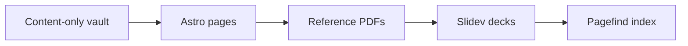

# teaman system reference

This document is the durable reference for how teaman turns a content-only
Obsidian vault into a static site. Use the navigation rail to move through the
system or search this document for a phrase such as **environment seam**.

## System boundary

The vault is data and the engine is code. A vault owns Markdown, configuration,
and public assets; it does not carry Astro pages, React components, build
scripts, or theme source. This boundary keeps upgrades predictable because an
engine release never has to merge with a vault's files.

| Owned by the vault | Owned by the engine |
| --- | --- |
| Notes, references, guides, dailies, decisions, slides | Astro routes and layouts |
| `teaman.config.mjs` | CLI and build orchestration |
| Optional `public/` assets | Search, diagrams, and PDF rendering |

### Content roots

Each content kind has one conventional directory. References are individual
Markdown documents under `references/`; nested directories become nested URL
slugs without changing the authoring model.

### Configuration contract

Configuration is pure serializable data. The CLI loads it once and passes it to
the engine, which merges partial values over safe defaults. Styling remains a
map of CSS custom properties so a vault never needs an engine-side component.

## Environment seam

The environment seam is the boundary between the CLI and every build stage.
Paths are resolved by the CLI, then communicated through a small set of
environment variables. The Astro application, reference PDF renderer, Slidev
builder, and Pagefind indexer all read the same values.

```text
TEAMAN_VAULT   source vault root
TEAMAN_OUT     staged output directory
TEAMAN_BASE    normalized deployment base path
TEAMAN_CONFIG  serialized vault configuration
TEAMAN_PUBLIC  staged passthrough assets
```

> [!important]
> A stage must preserve the environment seam. Reading from a repository-relative
> content path works for the bundled example but breaks the installed consumer
> path.

### Build isolation

Every production build writes into a staged sibling of the destination. Only a
successful pipeline is renamed into place, which prevents a failed build from
destroying the previous working site. Temporary Slidev and public-asset work
directories live outside the vault and are removed afterward.

### Base paths

All public URLs use a base with exactly one leading and trailing slash. A site
hosted at `/handbook/` therefore produces `/handbook/references/teaman-system/`
without special cases in the page component.

## Build pipeline

The pipeline is deliberately sequential because each later stage extends the
same static output.



1. Astro renders the content collections and reference reader pages.
2. Typst renders every publishable reference to a downloadable PDF.
3. Slidev renders presentation decks into their own static applications.
4. Pagefind indexes the completed HTML and adds custom records for content that
   does not exist as crawlable HTML.

### Reference PDFs

The PDF stage converts common Markdown structures into Typst markup, applies the
engine's bundled reference template, and writes `reference.pdf` beside the
document's generated `index.html`. Local images resolve from the document, vault,
or vault `public/` directory. Missing images become labelled placeholders rather
than breaking an otherwise useful document.

### Search indexing

Site-wide search is generated after every content renderer has finished. The
document search in the left rail is separate: it segments the rendered page by
heading in the browser and reports the precise sections containing a phrase.
That keeps it fast, private, and available on a fully static host.

## Operations

Run `teaman doctor` before a build when upgrading an engine or changing a large
set of content. It validates the config, required frontmatter, guide summaries,
decision links, and unresolved wiki-links without paying for a full render.

### Release checks

The standard confidence ladder is:

- typecheck the Astro and TypeScript surface;
- run focused and full unit tests;
- build the bundled vault, including PDFs, slides, and search;
- run browser tests against the production preview;
- pack and install the npm artifact in a temporary consumer project.

### Failure triage

Start at the first failing stage. An Astro content error usually indicates a
schema or route problem; a Typst diagnostic points to PDF conversion or the
template; a Slidev failure belongs to a deck or theme; and a Pagefind failure
means the generated site could not be indexed.

## Authoring recommendations

Reference documents work best when second-level headings represent tasks or
system areas and third-level headings answer one focused question. Prefer a
short summary near the title, stable terminology, and explicit update dates.
Readers can then scan the table of contents, search by phrase, and judge the
document's freshness before committing to a long read.

### Keep sections self-contained

Open each section with the answer, then provide explanation, examples, and edge
cases. This makes a section useful when reached from search or a copied heading
link without requiring the reader to reconstruct the entire document.

### Preserve source portability

Use standard Markdown where practical and keep assets inside the vault. The
same source remains readable in Obsidian, on the generated site, and in the
Typst-produced PDF.
